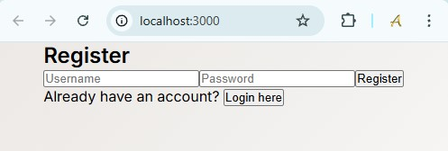
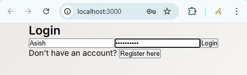
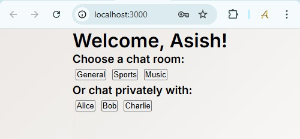
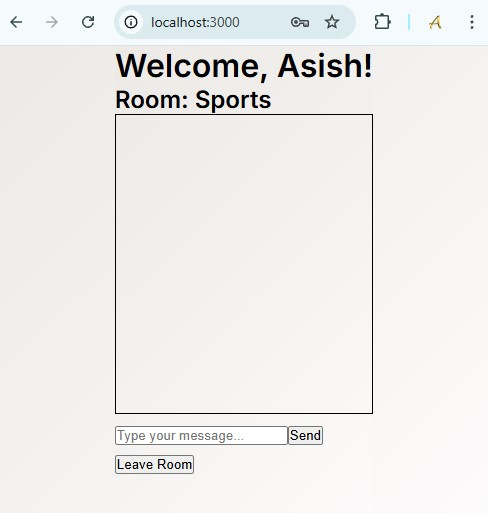
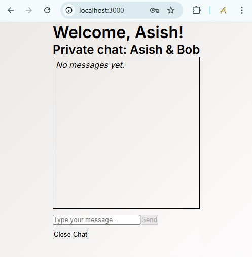

# 💬 Real-Time Chat Application

A fully functional **Chat Application** developed as part of the **PRODIGY InfoTech Web Development Internship (Task 04)**. It features a clean frontend interface and a lightweight backend using **Node.js** and **Express.js** to simulate message exchanges. This project demonstrates core chat logic, layout responsiveness, and potential real-time interaction structure.


## 🚀 Features
```
- 🎨 Clean and modern UI
- 💻 Real-time-like chat simulation
- ⏱️ Timestamp on messages
- 📱 Responsive layout for all devices
- 💡 Built with a scalable structure (frontend + backend)
- 🔄 Auto-scroll and message formatting
```


## 🛠️ Technologies Used

### 🔧 Frontend
- **HTML5** – Structure of the web app
- **CSS3** – Custom styles and layout
- **JavaScript (Vanilla)** – Dynamic DOM interaction
- **Tailwind CSS** *(Optional)* – Utility-first styling framework

### 🔌 Backend
- **Node.js** – Runtime environment for JavaScript server-side code
- **Express.js** – Web framework for routing and API setup
- **Socket.IO** *(optional/enhancement)* – Real-time, bi-directional communication
- **CORS** – Middleware to handle cross-origin requests
- **Nodemon** – Development tool for live reloading (for ease of development)


## 📁 Project Structure
```
PRODIGY_FS_04/
├── backend/
├── frontend/
├── node_modules/
├── screenshots/
├── README.md
├── package.json
└── package-lock.json

```

## 📸 Screenshots

### 📝🔐 Register and Login Page


### 🏠 Home Page


### 💬 Chat
 


## 📦 Installation & Usage

1. **Clone the repository**
   ```
   git clone https://github.com/Asish7980/PRODIGY_FS_04.git
   cd PRODIGY_FS_04
   ```
2. **Install backend dependencies**
```
npm install
```
3. **Start the server**
```
node server/server.js
# or during development
nodemon server/server.js
```
4. **Open your browser**
```
http://localhost:3000
```

## ✅ Learning Outcomes
- Practical experience with client-server communication
- Understanding of Express.js and middleware
- Layout creation with HTML/CSS and DOM scripting
- Real-time interaction simulation with Socket.IO (if used)

## 💡 Future Improvements
- Integrate real-time messaging with Socket.IO
- Add chat history using MongoDB
- Deploy using Render, Vercel, or Heroku
- Add dark mode and sound notifications

## 🙋‍♂️ Author
**Asish Shaw**

## 📃 License
This project is licensed under the MIT License.
